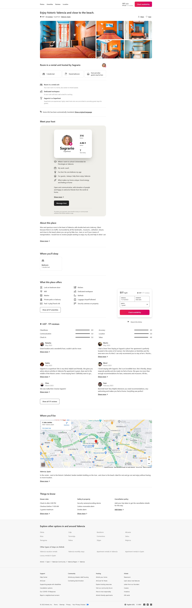
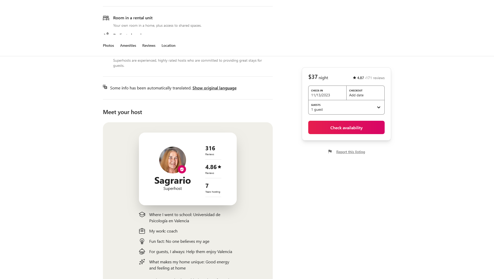
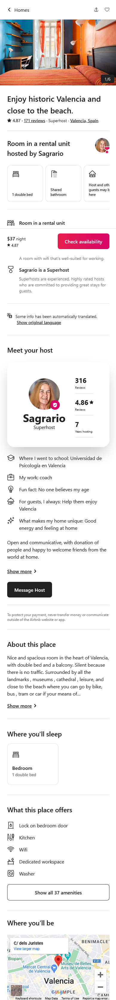
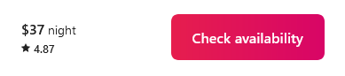

# Airbnb One page Clone

## Task for Bangla Puzzle Limited company

## Table of contents

- [Overview](#overview)
  - [Links](#links)
  - [The challenge](#the-challenge)
  - [How to run](#how-to-run)
  - [Screenshot](#screenshot)
- [My process](#my-process)
  - [Built with](#built-with)
- [Author](#author)

## Overview

### Links

- Solution URL: [github link](https://github.com/ankan-782/Airbnb-one-page-clone)
- Live Site URL: [live site link](https://airbnb-room-rental-design-rav.netlify.app/)

### The challenge

Users should be able to:

- View the optimal layout for the site depending on their device's screen size.
- See hover states for all interactive elements on the page.
- See many usage of intersection observer.
- See sticky element continuously on a particular section
- See grid layout of pictures on hero section for larger devices and scroll snap behavior on smaller devices.

### How to run

- Clone the repository:

```bash
git clone https://github.com/ankan-782/Desh-Career-clone-website
```

- Navigate to the project directory:

```bash
cd Desh-Career-clone-website
```

- Install dependencies:

```bash
npm install
```

- run the project:

```bash
npm run dev
```

### Screenshot

- Full page design in larger device



- Sticky element design (look at the site for preview)



- Site design in smaller device



- Bottom design in smaller device



## My process

### Built with

- React Js
- Semantic JSX markup
- Tailwind CSS
- Flex-box
- CSS Grid
- Position
- Mobile-first workflow

## Author

- Website - [Avijit Roy](https://avijit-roy-portfolio.netlify.app/)
- LinkedIn - [avijit-roy-ankan](https://www.linkedin.com/in/avijit-roy-ankan/)
- Twitter - [@AvijitAnkan](https://twitter.com/AvijitAnkan)
